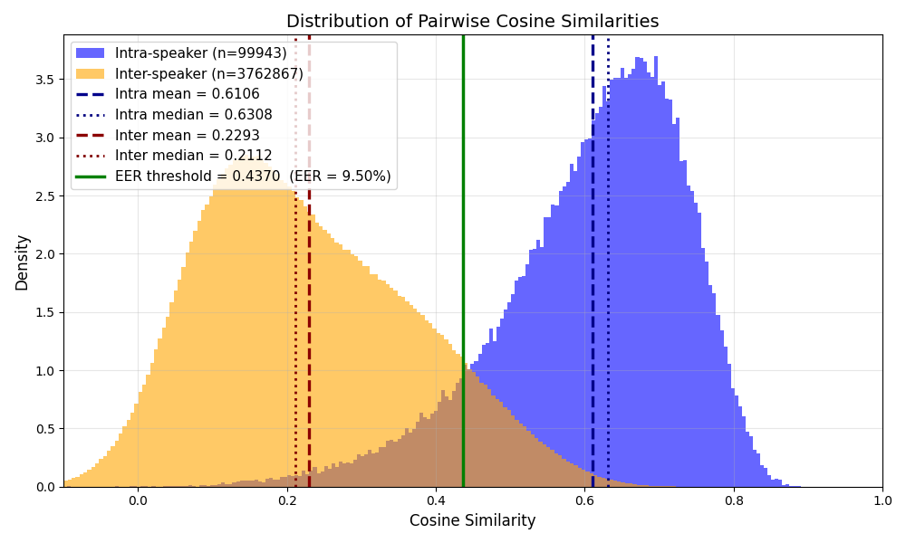
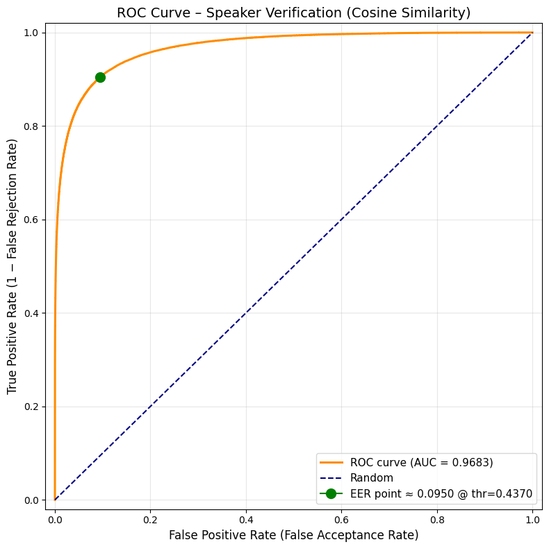

# Experimentation — Speaker Recognition Threshold

## Overview

The goal of this experimentation is to determine an optimal **cosine similarity threshold** to discriminate between speakers in our audio diarization pipeline. The threshold is used at inference time to decide whether a new voice embedding belongs to a known speaker or corresponds to a new one.

---

## Method

### Model

We use **Vosk** (`vosk-model-spk-0.4`) as a voice feature extractor. For each audio segment, Vosk produces a fixed-size embedding vector that encodes the speaker's voice characteristics. These embeddings are then compared using **cosine similarity**.

### Dataset

- **LibriSpeech `dev-clean`** split
- 40 speakers, multiple chapters and audio samples per speaker
- Audio files in `.flac` format, converted to 16kHz mono PCM at runtime via `ffmpeg`

### Embedding strategy

For each speaker, all audio samples across all their chapters are processed. Vosk segments the audio internally and produces one embedding per segment. All segment embeddings are accumulated to form a per-speaker embedding matrix.

---

## Data Preparation

### IQR Filtering

To avoid bias from speakers with too few or too many samples, we apply an **IQR outlier filter** on the number of embeddings per speaker:

```
lower_bound = Q1 - 1.5 × IQR
upper_bound = Q3 + 1.5 × IQR
```

Speakers outside this range are excluded from the threshold computation. This ensures the intra/inter similarity distributions are not skewed by imbalanced speakers.

### Normalization

All embedding vectors are L2-normalized before computing cosine similarities, so that similarity scores are bounded in [-1, 1].

---

## Similarity Analysis

Two types of pairwise cosine similarities are computed:

- **Intra-speaker**: between embeddings from the **same** speaker
- **Inter-speaker**: between embeddings from **different** speakers

Similarities are computed **pair-wise on individual segments** (not on centroids), because at inference time a single new segment will be compared to known speaker prototypes.

| Metric | Intra-speaker | Inter-speaker |
|---|---|---|
| Mean | higher | lower |
| Distribution | right-skewed, centered near 1 | left-skewed, centered near 0 |

The two distributions overlap in the mid-range, which is exactly where the threshold needs to be placed.

### Distribution Plot



The histogram above shows the density of pairwise cosine similarity scores for both intra-speaker (blue) and inter-speaker (orange) pairs, computed over the full LibriSpeech `dev-clean` split.

**Key observations:**

- The **intra-speaker distribution** (n = 99,943 pairs) is centered around a mean of **0.61** and a median of **0.63**, confirming that embeddings from the same speaker are consistently similar to one another.
- The **inter-speaker distribution** (n = 3,762,867 pairs) is centered around a mean of **0.23** and a median of **0.21**, showing that different speakers produce clearly distinct embeddings on average.
- The two distributions **overlap in the range [0.3, 0.55]**, forming a transition zone where classification errors are unavoidable regardless of the threshold chosen. This overlap is the core challenge of zero-shot speaker verification.
- The **EER threshold (green vertical line at 0.437)** is placed squarely in the middle of this overlap zone, balancing false acceptances and false rejections symmetrically.

The large asymmetry in pair counts (inter >> intra) is expected: for N speakers, inter-speaker pairs grow as O(N²) while intra-speaker pairs grow linearly with the number of segments per speaker.

---

## Threshold Selection

### Why EER?

Several threshold strategies were considered:

| Strategy | Description | Drawback |
|---|---|---|
| Mean / Median | Simple statistical cutoff | Ignores error trade-off |
| Minimize total error rate | Minimizes FA + FR | Biased towards majority class |
| **EER (Equal Error Rate)** | Balances False Acceptance and False Rejection | Best for symmetric speaker verification |

The **EER** is defined as the point on the ROC curve where:

```
False Positive Rate ≈ False Negative Rate
```

It represents the most balanced operating point for speaker verification, treating missed speaker matches and false speaker matches as equally undesirable.

### ROC Curve

The ROC curve is computed from the binary classification problem:
- **Positive label (1)**: intra-speaker pair (same speaker)
- **Negative label (0)**: inter-speaker pair (different speakers)

```
scores  = [intra_similarities..., inter_similarities...]
labels  = [1, 1, ..., 0, 0, ...]
```

### ROC Curve Plot



The ROC curve above plots the True Positive Rate (1 − False Rejection Rate) against the False Positive Rate (False Acceptance Rate) across all possible cosine similarity thresholds.

**Key observations:**

- The curve rises **steeply toward the top-left corner**, indicating that the Vosk speaker embeddings are highly discriminative: the model achieves a high true positive rate at very low false positive rates.
- The **AUC of 0.9683** means that, if we pick a random intra-speaker pair and a random inter-speaker pair, the model correctly ranks the intra-speaker pair as more similar ~97% of the time. This is close to the perfect score of 1.0.
- The **EER operating point** (green dot) is located at approximately FPR = TPR = 0.095, confirming that the optimal threshold yields symmetric error rates of ~9.5% in both directions.
- The **dashed diagonal** represents a random classifier (AUC = 0.5). The distance between our curve and this baseline illustrates the practical value of the Vosk speaker embeddings.


### Results

| Metric | Value | Interpretation |
|---|---|---|
| **AUC** | 0.9823 | The model separates same-speaker from different-speaker pairs with 98.23% accuracy under the ROC curve — close to perfect (1.0) |
| **EER** | 0.0950 | At the optimal threshold, 9.50% of pairs are misclassified in each direction — the model makes an error roughly 1 time in 10 |
| **Optimal threshold** | 0.4217 | A cosine similarity above 0.4217 means "same speaker"; below means "different speaker" |

These results indicate a **strong speaker discriminability**. An AUC of 0.98 means the embeddings produced by Vosk's speaker model are highly separable between speakers.

The EER of ~9.5% is acceptable for a zero-shot system — no speaker-specific training was done, the threshold is derived purely from the LibriSpeech `dev-clean` distribution. In practice this means:

- **False Acceptance Rate (FAR) ≈ 9.5%**: ~1 in 10 segments from a *different* speaker will be incorrectly assigned to a known speaker
- **False Rejection Rate (FRR) ≈ 9.5%**: ~1 in 10 segments from the *same* speaker will be incorrectly treated as a new speaker

The EER operating point is a deliberate trade-off: it treats both error types as equally costly. If the application were more sensitive to one type of error (e.g. security-critical speaker verification), the threshold could be shifted accordingly.

> **Note:** exact numeric values are saved in `threshold_dev-clean.json` after running `speaker_embedding_threshold.py`. The JSON also contains `n_speakers_total`, `n_speakers_after_iqr`, `n_intra_pairs`, and `n_inter_pairs` for full reproducibility.

---

## Artefacts

| File | Description |
|---|---|
| `speakers_embeddings_dev-clean.npz` | Cached speaker embeddings (reused across runs) |
| `threshold_dev-clean.json` | EER threshold + AUC + EER + metadata |
| `speaker_similarity_distributions.png` | Distribution plot of intra/inter similarities |

---

## How to Reproduce

```bash
# With data already local
python src/speaker_embedding_threshold.py \
    --local \
    --ds_dir ./data/LibriSpeech/ \
    --vosk_model ../models/vosk-model-en-us-0.22 \
    --spk_model  ../models/vosk-model-spk-0.4

# With data downloaded automatically from GCS
python src/speaker_embedding_threshold.py \
    --ds_dir ./data/LibriSpeech/ \
    --vosk_model ../models/vosk-model-en-us-0.22 \
    --spk_model  ../models/vosk-model-spk-0.4
```
